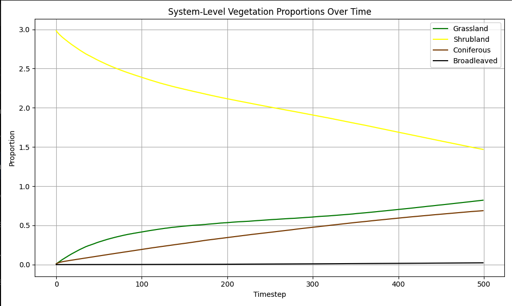

# Modified Batllori Model

The modified Batllori model simulates vegetation dynamics in a fire-prone ecosys-
tem, representing the landscape as a grid of cells, each of which contains a mix
of four vegetation types: grass, shrubs, coniferous trees, and broadleaved trees.
Each vegetation type has distinct growth patterns, flammability, and responses
to disturbances, which drive transitions between vegetation states over time.
This model captures the dynamics of vegetation succession, fire disturbances,
and feedback mechanisms that lead to alternative stable states, such as persis-
tent grasslands or resilient woodlands.

Based on [Cumulative effects of fire and drought in Mediterranean ecosystems](https://iopscience.iop.org/article/10.1088/1748-9326/10/3/034018)


### How to run

Create a virtualenvironment and install the required dependencies

```bash
python3 -m venv venv
source venv/bin/activate
pip install -r requirements.txt
```

Run the model

```bash
python model.py
```

#### Example output

